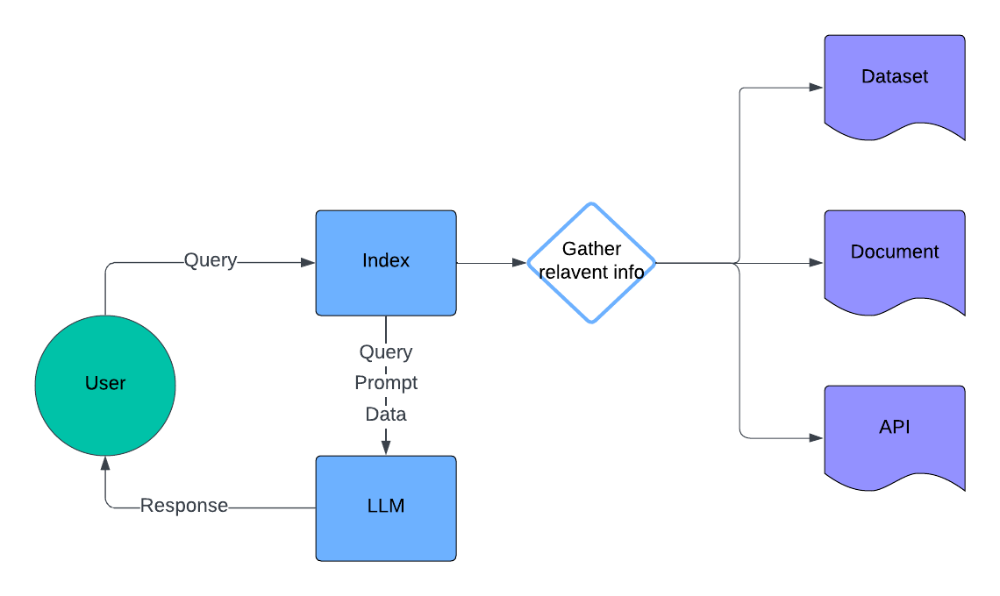

# Hip-Hop Genie

## Table of Contents
- [About the Project](#about-the-project)
- [Why not ChatGPT?](#why-not-chatgpt)
- [Getting Started](#getting-started)
- [Uses](#uses)
- [Demo](#demo)

## About the Project
Hip-Hop Genie is inspired by the desire to not only find specific lyrics but also to deconstruct them and even create your own. With Hip-Hop Genie, you can:
- Find information on your favorite artists and their songs.
- Create your own lyrics with the help of advanced AI.

Using Retrieval-Augmented Generation (RAG) and the Genius API, alongside ChatGPT and Llama-Index, Hip-Hop Genie provides a comprehensive tool for hip-hop enthusiasts and aspiring lyricists.

## Why not ChatGPT?
Unlike ChatGPT, Hip-Hop Genie does not have the most up-to-date information. As of this post, Hip-Hop Genie has data up to January 2022.

*UPDATE: with the release of GPT4 and GPT4o, that is no longer the case*

### However! This is your personalized assistant
With the goal of uniqueness and personal privacy, a personal agent is useful in using data that only you have control of, without the worries of BIG TECH companies coming after you.

## Getting Started
To get started with Hip-Hop Genie, follow these steps:
1. Clone the repository: `git clone https://github.com/your-repo/hip-hop-genie.git`
2. Install the necessary dependencies: `pip install -r requirements.txt`
3. Set up the Genius API key: 
   - Sign up at [Genius](https://genius.com/developers) to get your API key.
   - Create a `.env` file and add your API key: `GENIUS_API_KEY=your_api_key`
4. Run the application using streamlit: `python -m streamlit run app.py`

## Uses
Hip-Hop Genie can be used for:
- Finding lyrics and detailed information about hip-hop songs and artists.
- Analyzing lyrics for themes, patterns, and stylistic elements.
- Generating original hip-hop lyrics using AI.

## Demo
Check out our demo to see Hip-Hop Genie in action!

---

